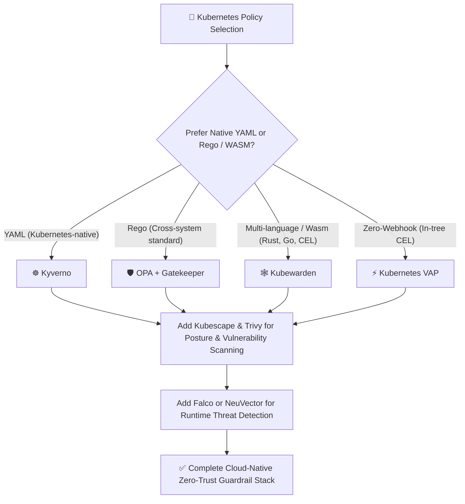

  

# 🛡️ Awesome Kubernetes Policy Management

  
  
  
  
  
  
  

---

## ⚡ Top Kubernetes Policy Management &amp; Governance Ecosystem

> 🎯 **Curated Directory of SaaS Solutions, Commercial Enterprise Platforms &amp; Open-Source Projects for Cloud-Native Policy-as-Code (PaC), Admission Control, Security Posture (KSPM), Compliance Scanning &amp; Runtime Guardrails.**

**Last updated: August 2026** 📅

---

### 📖 Introduction &amp; Scope

Modern **Kubernetes Policy Management** guarantees operational resilience, compliance (CIS, SOC2, HIPAA, PCI-DSS), Zero-Trust security, and cost efficiency across distributed clusters. This ecosystem repository catalogs:
- 🚪 **Admission Controllers &amp; Policy Engines**: Intercepting and enforcing declarative guardrails (validation, mutation, generation) before resources are persisted to `etcd`.
- 📜 **Policy-as-Code (PaC)**: Version-controlled policies authored in YAML, Rego, CEL, or WebAssembly (WASM).
- 🔍 **Static Manifest Analysis &amp; CI/CD Linters**: Shift-left security scanners preventing misconfigured workloads from reaching production.
- 🛡️ **Kubernetes Security Posture Management (KSPM) &amp; Runtime Defense**: Continuous posture benchmarking, network microsegmentation, and anomaly detection.

---

## 📑 Table of Contents

- [🏢 SaaS &amp; Commercial Enterprise Platforms](#-saas--commercial-enterprise-platforms)
- [🌟 Open-Source GitHub Projects](#-open-source-github-projects)
- [🧩 Additional Policy &amp; Security Tools](#-additional-policy--security-tools)
- [💡 Architectural Guidance: Choosing the Right Policy Engine](#-architectural-guidance-choosing-the-right-policy-engine)
- [🤝 How to Contribute](#-how-to-contribute)
- [📈 Star History](#-star-history)
- [⚠️ Disclaimer](#️-disclaimer)

---

## 🏢 SaaS &amp; Commercial Enterprise Platforms

> 🌐 **Market Overview &amp; Industry Dynamics**: The global Cloud-Native &amp; Kubernetes Security and Policy Management market is estimated at **$2.2B – $2.7B in 2025–2026** (projected to exceed **$7.5B by 2030**). The sector is **moderately to highly fragmented**—spanning specialized admission controllers, multi-cluster control planes, CNAPP suites, and network policy engines rather than a winner-take-all monopoly, driven by multi-cloud complexity and robust open-source foundations.

*The table below is sorted in descending order by company scale, enterprise valuation, and annual revenue.*

| Product / Platform | Company Scale / Valuation / Revenue | Description &amp; Core Focus | Starting Pricing | Free Tier / Trial Limits |
| :--- | :--- | :--- | :--- | :--- |
| **[Rancher / SUSE Rancher Prime](https://www.rancher.com/)** | **~$4.0B – $6.0B** Enterprise Valuation (~$800M+ Annual Revenue) | Enterprise multi-cluster Kubernetes management platform with centralized policy enforcement, RBAC, and multi-cloud governance. | **$25 / vCPU / month** via AWS Marketplace (or on-demand tiers starting at **$112 / node / month**) | **30-day free trial** on AWS Marketplace and SUSE Developer Access (core Rancher Manager is 100% free open-source) |
| **[SUSE NeuVector Prime](https://www.suse.com/products/neuvector/)** | **~$4.0B – $6.0B** Enterprise Valuation (~$800M+ Annual Revenue) | Full-lifecycle container and Kubernetes security platform with Zero-Trust layer-7 network segmentation and runtime policy guardrails. | **$112 / node / month** (Marketplace entry tier for 5–15 nodes, 5-node minimum) | **Free open-source edition** (indefinite community use); **30-day enterprise evaluation** via Rancher Prime bundle |
| **[Aqua Security](https://www.aquasec.com/)** | **$1.0B+** Valuation (Series E Unicorn / ~$90M ARR) | Full cloud-native application protection platform (CNAPP) with Kubernetes admission controls, runtime protection, and policy scanning. | **~$4,166 / month** ($50,000 / year base commercial tier for enterprise workload packages; pay-per-scan marketplace options) | **14 to 30-day proof-of-concept trial** (available upon request/demo); free open-source scanning via Trivy |
| **[Tigera Calico Cloud](https://www.tigera.io/)** | **~$250M – $350M** Est. Valuation ($65M+ VC Funding / ~$30M+ ARR) | Cloud-native network security, egress gateway controls, observability, and runtime policy enforcement for Kubernetes. | **$0.025 / vCPU-hour** (Pay-as-you-go; starts at **~$90 / month** for 5 vCPUs or **$180 / month** for 10 vCPUs on AWS Marketplace) | **Free forever tier**: 1 cluster for network observability and Policy Board; **14-day free trial** with full multi-cluster security |
| **[Styra DAS / Enterprise OPA](https://www.styra.com/)** | **~$180M – $250M** Est. Valuation ($54M+ VC Funding / ~$15M ARR) | Centralized control plane and policy lifecycle management for Open Policy Agent (OPA) and Kubernetes Gatekeeper. | **$1,000 / month** (Pro/Enterprise tier baseline supporting up to 50 managed nodes) | **Free forever tier**: Up to 2 clusters and 10 nodes with full OPA policy authoring and validation |
| **[Kubescape / ARMO Platform](https://armosec.io/)** | **~$100M – $150M** Est. Valuation ($30M+ VC Funding / Early ARR) | Enterprise security platform built on CNCF Kubescape offering multi-cluster posture management, risk scoring, and runtime detection. | **$30 / worker node / month** (Startup plan covering automated scanning, RBAC analysis, and CI/CD integrations) | **Free forever plan**: 1 cluster and up to 50 worker nodes with continuous compliance scanning and risk analysis |
| **[Fairwinds Insights](https://www.fairwinds.com/)** | **~$30M – $50M** Est. Valuation ($14M+ VC Funding / ~$8M ARR) | Kubernetes governance and posture platform combining admission control, configuration validation (Polaris), and cost optimization. | **$100 / node / month** ($1,200 / node / year via AWS Marketplace EKS Edition) | **Free forever plan**: Up to 20 nodes, 2 clusters, 1 repository, unlimited users, and 30-day metric retention |
| **[Kyverno Enterprise / Nirmata](https://nirmata.com/)** | **~$30M – $45M** Est. Valuation ($15M+ VC Funding / ~$3.7M ARR) | Enterprise governance, multi-cluster management plane, and SLA support for Kyverno policy engine. | **$1,250 / month** (Business plan covering up to 20 clusters or 250 nodes; additional capacity billed via tiered nodes) | **15-day free trial** with full enterprise features (also free up to 3 nodes via Kyverno Operator without license key) |

---

## 🌟 Open-Source GitHub Projects

> 🔓 **Open-Source Supremacy**: The Kubernetes policy ecosystem is predominantly open-source driven. The CNCF graduated and incubating projects form the bedrock upon which enterprise cloud platforms are constructed.

*The list below is sorted in descending order by GitHub stargazer count.*

1. **[Trivy](https://github.com/aquasecurity/trivy)**   
   Comprehensive, fast security scanner for container images, Kubernetes manifests, IaC templates, SBOMs, and policy misconfigurations.

2. **[Open Policy Agent (OPA)](https://github.com/open-policy-agent/opa)**   
   CNCF Graduated general-purpose policy engine that unifies policy enforcement across the cloud-native stack using the declarative query language **Rego**.

3. **[Kubescape](https://github.com/kubescape/kubescape)**   
   CNCF open-source Kubernetes security platform scanning clusters and YAML manifests against CIS benchmarks, NSA-CISA, and MITRE ATT&CK frameworks.

4. **[Falco](https://github.com/falcosecurity/falco)**   
   CNCF Graduated cloud-native runtime security engine that analyzes Linux kernel syscalls and Kubernetes audit logs to detect abnormal behavior and policy breaches in real time.

5. **[Checkov](https://github.com/bridgecrewio/checkov)**   
   Static code analysis and policy-as-code tool for Kubernetes manifests, Helm charts, Kustomize, Terraform, and CloudFormation to prevent misconfigurations during CI/CD.

6. **[kube-bench](https://github.com/aquasecurity/kube-bench)**   
   Checks whether Kubernetes nodes, master components, and etcd configurations comply with security recommendations defined in the official CIS Kubernetes Benchmark.

7. **[Kyverno](https://github.com/kyverno/kyverno)**   
   CNCF Incubating Kubernetes-native policy engine that uses declarative YAML. Supports admission validation, mutation, generation, image verification (Sigstore/Cosign), and background auditing without requiring a specialized domain-specific language.

8. **[Project Calico](https://github.com/projectcalico/calico)**   
   Cloud-native networking and network security provider that implements high-performance eBPF/iptables data planes and fine-grained Kubernetes NetworkPolicies.

9. **[Popeye](https://github.com/derailed/popeye)**   
   Kubernetes cluster resource sanitizer that inspects live clusters and reports misconfigurations, dead resources, and policy violations against operational best practices.

10. **[Datree](https://github.com/datreeio/datree)**   
    CLI and admission webhook that automates policy enforcement by checking Kubernetes manifests against schema validation, resource limits, and custom security rules.

11. **[Cosign (Sigstore)](https://github.com/sigstore/cosign)**   
    Container signing, verification, and software supply chain policy enforcement tool integrated with Kubernetes admission webhooks.

12. **[kube-hunter](https://github.com/aquasecurity/kube-hunter)**   
    Penetration testing and automated security weakness hunter designed to uncover vulnerabilities in Kubernetes cluster networks and node configurations.

13. **[OPA Gatekeeper](https://github.com/open-policy-agent/gatekeeper)**   
    CNCF validating and mutating admission webhook that integrates OPA with Kubernetes using custom resource definitions (`ConstraintTemplates` and `Constraints`).

14. **[KubeLinter](https://github.com/stackrox/kube-linter)**   
    Static analysis tool that checks Kubernetes YAML manifests and Helm charts to verify adherence to production readiness and security best practices.

15. **[Polaris](https://github.com/FairwindsOps/polaris)**   
    Configuration validation engine and dashboard by Fairwinds enforcing guardrails for resource requests, health probes, and security contexts.

16. **[Conftest](https://github.com/open-policy-agent/conftest)**   
    Testing framework for structured configuration files (Kubernetes YAML, Terraform, Dockerfiles) using OPA Rego queries before deploying to production.

17. **[kube-score](https://github.com/zegl/kube-score)**   
    Static code analysis tool that parses Kubernetes object definitions and scores them against reliability, network security, and pod security guidelines.

18. **[NeuVector](https://github.com/neuvector/neuvector)**   
    Open-source container security platform with layer-7 container network inspection, automated policy generation, and real-time vulnerability scanning.

19. **[Kubewarden (Admission Controller)](https://github.com/kubewarden/adm-controller)**   
    CNCF Sandbox/Incubating WebAssembly-powered Kubernetes admission controller executing policies written in Rust, Go, CEL, or Rego and distributed via OCI registries.

---

## 🧩 Additional Policy &amp; Security Tools

- ⚙️ **Kubernetes Validating Admission Policy (VAP)**: Native in-tree Common Expression Language (CEL)-based admission policies (GA in modern Kubernetes releases) providing ultra-low-latency in-process evaluation without external webhooks.
- 🔐 **Sigstore &amp; Policy Controller**: SLSA provenance, attestation verification, and keyless cryptographic signing for container images.
- 🌐 **Cilium Network Policies**: Advanced layer 3–7 network policies and Zero-Trust service mesh security powered by Linux eBPF.
- 📚 **Community Policy Libraries**: Reusable `ConstraintTemplates` from Gatekeeper and curated policy catalogs maintained by the Kyverno community.

---

## 💡 Architectural Guidance: Choosing the Right Policy Engine

- **Choose [Kyverno](https://github.com/kyverno/kyverno)** if your platform engineering team wants Kubernetes-native YAML policy authoring, automated resource mutation/generation, and native Sigstore image verification with zero DSL learning curve.
- **Choose [OPA Gatekeeper](https://github.com/open-policy-agent/gatekeeper)** if your organization enforces cross-platform authorization (API gateways, Terraform, CI/CD, and Kubernetes) using a unified Rego rules engine.
- **Choose [Kubewarden](https://github.com/kubewarden/adm-controller)** if you prefer writing policies in general-purpose languages (Rust, Go, TypeScript) and packaging them as portable WebAssembly OCI artifacts.
- **Choose [Validating Admission Policy (VAP)](https://kubernetes.io/docs/reference/access-authn-authz/validating-admission-policy/)** for built-in, lightweight CEL checks that execute directly inside `kube-apiserver` without admission webhook latency.

---

## 🤝 How to Contribute

Contributions are welcome! Please follow these guidelines:

1. 🍴 Fork the repository.
2. 📝 Add or update entries in `README.md` (maintain alphabetical or star-ranked order).
3. 🔗 Include: official project name, GitHub/homepage link, star badge, and an accurate 1–2 sentence description.
4. 🚀 Submit a Pull Request with a descriptive summary of your additions.

⭐ *Star this repository if you find it helpful for your Kubernetes platform engineering journey!*

---

## 📈 Star History

---

## ⚠️ Disclaimer

- This is a **community-curated** list for informational and educational purposes only.
- Kubernetes admission controllers and policy engines directly impact cluster availability and workload lifecycles. Thorough testing in non-production environments, audit modes, and phased rollouts are strongly recommended before enforcing strict rejection rules.
- Commercial trademarks and logos belong to their respective owners.

---

  <b>Built with ❤️ for platform engineers, Kubernetes administrators, security teams, and DevSecOps practitioners worldwide.</b>

